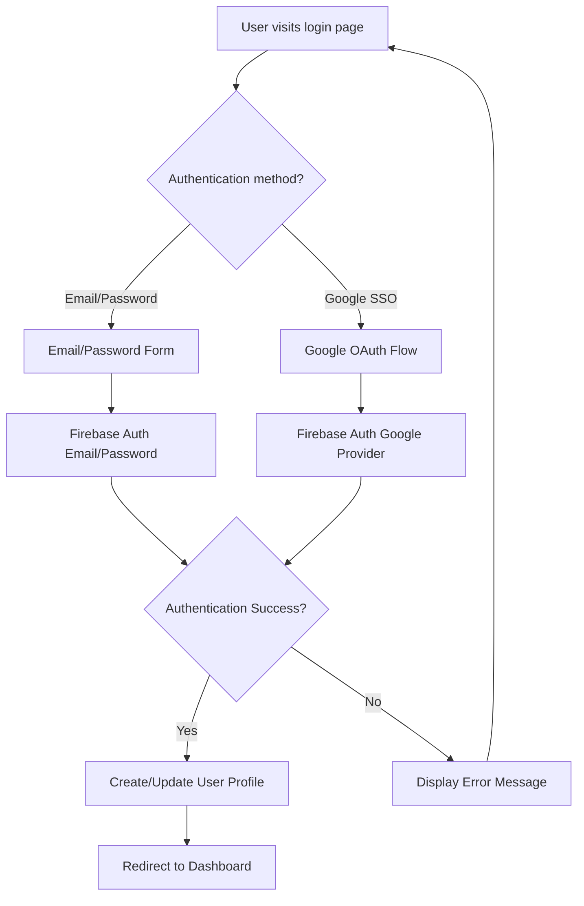
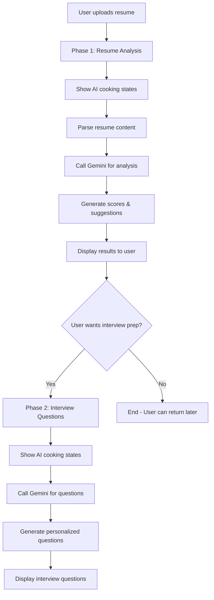
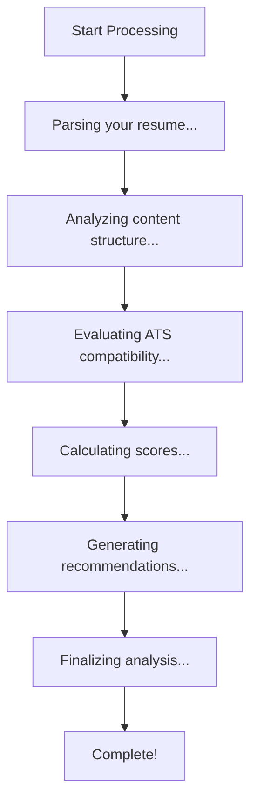

# Design Document

## Overview

This design document outlines the implementation of enhanced authentication features and Gemini API integration fixes for ResumeFlow. The solution will integrate Google SSO authentication alongside existing email/password authentication, create a professional login interface, and fix the Gemini API integration to use the correct SDK and configuration.

## Architecture

### Authentication Flow Architecture



### Gemini API Integration Architecture - Two Phase Process



### AI Processing States Architecture



## Components and Interfaces

### Authentication Components

#### Enhanced Login Page Component
- **Location**: `app/login/page.tsx`
- **Purpose**: Provides unified authentication interface with email/password and Google SSO options
- **Key Features**:
  - Professional, responsive design
  - Google Sign-In button integration
  - Form validation and error handling
  - Loading states and transitions

#### Updated Auth Context
- **Location**: `lib/auth-context.tsx`
- **Purpose**: Manages authentication state and provides auth methods
- **New Methods**:
  - `signInWithGoogle()`: Handles Google OAuth flow
  - Enhanced error handling for all auth methods

#### Auth Configuration
- **Location**: `lib/firebase.ts`
- **Purpose**: Configure Firebase Auth with Google provider
- **Updates**: Add Google Auth provider configuration

### Gemini API Components

#### Fixed Gemini Client
- **Location**: `lib/gemini.ts`
- **Purpose**: Proper Gemini API integration with correct SDK
- **Key Changes**:
  - Use `@google/generative-ai` instead of `@google/genai`
  - Correct model initialization and configuration
  - Set `thinkingBudget: 0` as requested
  - Proper error handling and response parsing

#### API Routes - Two Phase Process
- **Location**: `app/api/gemini/` directory
- **Purpose**: Server-side Gemini API calls to protect API keys
- **Phase 1 Routes**:
  - `POST /api/gemini/analyze-resume` - Complete resume analysis with scoring and suggestions
- **Phase 2 Routes**:
  - `POST /api/gemini/generate-questions` - Generate interview questions based on analyzed resume
  - `POST /api/gemini/evaluate-response` - Evaluate user's interview responses

#### AI Loading States Component
- **Location**: `components/ui/AILoadingStates.tsx`
- **Purpose**: Show engaging "AI cooking" messages during processing
- **Features**:
  - Sequential loading messages that show what AI is doing
  - Animated progress indicators
  - Different message sets for resume analysis vs interview question generation

## Data Models

### User Profile Model (Firestore)
```typescript
interface UserProfile {
  uid: string;
  email: string;
  displayName: string;
  photoURL?: string;
  provider: 'email' | 'google.com';
  createdAt: Timestamp;
  lastLoginAt: Timestamp;
  preferences: {
    targetRole?: string;
    industry?: string;
    experienceLevel?: string;
  };
}
```

### Authentication State Model
```typescript
interface AuthState {
  user: User | null;
  loading: boolean;
  error: string | null;
}
```

### Gemini API Models
```typescript
interface GeminiConfig {
  model: 'gemini-2.5-flash';
  generationConfig: {
    temperature: number;
    topK: number;
    topP: number;
    maxOutputTokens: number;
    thinkingBudget: 0;
  };
}

interface GeminiResponse<T> {
  success: boolean;
  data?: T;
  error?: string;
}

interface AILoadingState {
  phase: 'resume-analysis' | 'interview-generation';
  step: number;
  totalSteps: number;
  message: string;
  progress: number; // 0-100
}

interface ResumeAnalysisProgress {
  parsing: boolean;
  analyzing: boolean;
  scoring: boolean;
  generating: boolean;
  finalizing: boolean;
  complete: boolean;
}
```

## Error Handling

### Authentication Error Handling
- **Google OAuth Errors**: Handle popup blocked, user cancellation, network issues
- **Firebase Auth Errors**: Map Firebase error codes to user-friendly messages
- **Session Management**: Handle token expiration and refresh
- **Network Errors**: Retry mechanisms and offline handling

### Gemini API Error Handling
- **API Key Issues**: Validate environment variables on startup
- **Rate Limiting**: Implement exponential backoff and user feedback
- **Model Errors**: Parse and handle Gemini-specific error responses
- **Network Failures**: Fallback responses and retry logic

## Testing Strategy

### Authentication Testing
- **Unit Tests**: Auth context methods, error handling, state management
- **Integration Tests**: Firebase Auth flows, Google OAuth integration
- **E2E Tests**: Complete login/logout flows, session persistence
- **Security Tests**: Token validation, unauthorized access prevention

### Gemini API Testing
- **Unit Tests**: API client initialization, response parsing, error handling
- **Integration Tests**: End-to-end API calls with mock responses
- **Performance Tests**: Response time and rate limiting behavior
- **Error Scenario Tests**: Network failures, invalid responses, quota exceeded

## Security Considerations

### Authentication Security
- **Token Management**: Secure storage and transmission of auth tokens
- **CSRF Protection**: Implement CSRF tokens for state-changing operations
- **Session Security**: Proper session timeout and cleanup
- **Input Validation**: Sanitize all user inputs before processing

### API Security
- **Environment Variables**: Secure storage of API keys and secrets
- **Server-Side Only**: Ensure Gemini API keys never reach client-side
- **Rate Limiting**: Implement per-user rate limiting for API calls
- **Input Sanitization**: Validate and sanitize all API inputs

## Implementation Details

### Google SSO Integration
1. **Firebase Configuration**: Enable Google Auth provider in Firebase Console
2. **OAuth Setup**: Configure OAuth consent screen and authorized domains
3. **Client Integration**: Use Firebase Auth Google provider with popup/redirect flow
4. **Profile Sync**: Automatically sync Google profile data to Firestore

### Gemini API Migration
1. **Package Update**: Replace `@google/genai` with `@google/generative-ai`
2. **Client Initialization**: Update import statements and initialization code
3. **Configuration**: Set correct model name and generation config with `thinkingBudget: 0`
4. **API Routes**: Move all Gemini calls to server-side API routes

### UI/UX Enhancements
1. **Design System**: Implement consistent color scheme and typography
2. **Responsive Design**: Ensure mobile-first responsive layout
3. **Loading States**: Add skeleton loaders and progress indicators
4. **Error States**: Design clear error messages and recovery actions
5. **Accessibility**: Implement ARIA labels and keyboard navigation

### AI Loading States Implementation
1. **Phase 1 - Resume Analysis Loading Messages**:
   - "🔍 Parsing your resume..."
   - "📊 Analyzing content structure..."
   - "🎯 Evaluating ATS compatibility..."
   - "📈 Calculating performance scores..."
   - "💡 Generating personalized recommendations..."
   - "✨ Finalizing your analysis..."

2. **Phase 2 - Interview Questions Loading Messages**:
   - "🧠 Understanding your background..."
   - "💼 Researching industry standards..."
   - "❓ Crafting personalized questions..."
   - "🎯 Tailoring difficulty levels..."
   - "📝 Preparing your interview session..."

3. **Loading State Features**:
   - Progressive step indicators (1/6, 2/6, etc.)
   - Animated progress bar with smooth transitions
   - Estimated time remaining display
   - Engaging micro-animations and icons
   - Responsive design for mobile devices

### Two-Phase User Experience Flow
1. **Phase 1 Entry**: User uploads resume → Immediate AI processing begins
2. **Phase 1 Results**: Display comprehensive analysis with option to proceed
3. **Phase 2 Trigger**: "Generate Interview Questions" button becomes available
4. **Phase 2 Processing**: New set of AI cooking messages for question generation
5. **Phase 2 Results**: Personalized interview questions ready for practice

### Performance Optimizations
1. **Code Splitting**: Lazy load authentication components
2. **Caching**: Implement response caching for Gemini API calls
3. **Bundle Size**: Optimize imports and remove unused dependencies
4. **Image Optimization**: Use Next.js Image component for profile pictures
5. **Progressive Loading**: Stream AI responses to show partial results during processing